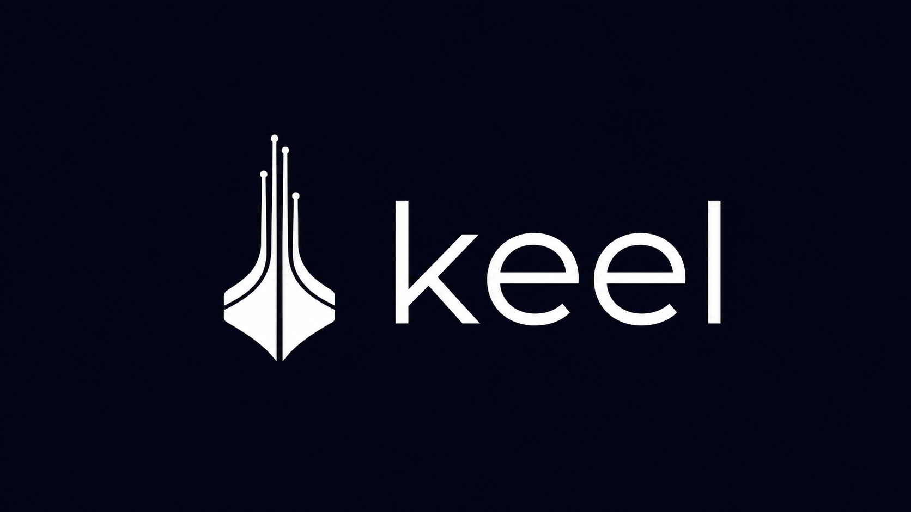

<p align="center">
  
</p>

<p align="center">
  One command from zero to a production-shaped serverless infrastructure on Scaleway<br>(Terraform + GitHub Actions + Infisical).
</p>

<p align="center">
  <a href="https://github.com/Gambi97/keel/actions/workflows/ci.yml"></a>
  
  <a href="LICENSE"></a>
</p>

<p align="center">
  <a href="#quickstart">Quickstart</a> ·
  <a href="#why-keel">Why keel</a> ·
  <a href="#what-gets-created-and-when">What gets created</a> ·
  <a href="#what-it-costs-to-start">Costs</a> ·
  <a href="#faq">FAQ</a>
</p>

A ship's keel is the first beam laid down, the backbone everything else is
built onto. `keel` lays that foundation for whatever you are building: a
complete serverless infrastructure on [Scaleway](https://www.scaleway.com),
provisioned by Terraform, deployed by GitHub Actions, with secrets in
[Infisical](https://infisical.com). It does not generate an app: you bring a
Docker image, keel gives it a place to run. You answer a few questions, push
to `main`, and the infrastructure is live.

- **Near-free to start.** Compute and database scale to zero; an idle project
  costs cents per month, with no expiring trial.
- **Scales with your product.** Staging and prod from day one; growing is a
  one-line tfvars change reviewed in a PR.
- **Nothing to install.** No Terraform, no cloud CLI. Node and git, done.
- **No secrets in the repo, ever.** Encrypted CI secrets and a dedicated
  secret manager, wired for you.
- **No lock-in of your code.** Your app is a plain Docker image on a port.

## Quickstart

You need Node >= 18.17, git, and credentials for Scaleway, Infisical and
GitHub (see [Prerequisites](#prerequisites) for how to get each one).

```sh
npx keel-cli
```

The CLI asks for a project name, region, repository name and visibility, picks
up `SCW_*` / `INFISICAL_*` / `GITHUB_TOKEN` from your environment as defaults,
then shows a **complete summary of what it will create and where**. Nothing is
touched before you confirm. When it finishes, push to `main` (or merge the
first PR) and the pipeline provisions the infrastructure.

Non-interactive and dry-run:

```sh
# scripts / CI: every question has a flag
npx keel-cli --yes --name my-app --region fr-par --private

# preview: generates the repo locally, touches no account
npx keel-cli --dry-run --yes --name my-app
```

See the full [CLI reference](#cli-reference) for all flags, or pass
`--config answers.json`.

## Why keel

Getting anything real online means gluing together a cloud account, a
container runtime, a database, a state store, a CI/CD pipeline and a secret
manager, then threading credentials through all of them without leaking
anything. It is a day of undifferentiated setup before the first line of
product.

`keel` collapses that into one command, guided by three opinions:

**1. Start near zero, grow without re-architecting.**
Both compute (Serverless Containers) and database (Serverless SQL) bill per
use and scale to zero. The same repo that costs cents while you validate the
idea carries real traffic later by bumping two numbers in a tfvars file.
See [the cost breakdown](#what-it-costs-to-start).

**2. The repository is the single source of truth, and it holds zero secrets.**
All infrastructure is Terraform reviewed in PRs; nothing is click-configured.
Terraform runs in CI, never on a laptop. Credentials live in GitHub's
encrypted store (CI) and Infisical (application), so rotating a secret never
requires a commit.

**3. Infrastructure only, no framework.**
keel generates no application skeleton. Your app is any Docker image,
listening on a port, reading its config from environment variables. Nothing
to rewrite if you outgrow the stack.

### Why Scaleway, and not AWS or the others

AWS can absolutely do this, but the equivalent setup on AWS means assembling
Lambda + API Gateway + Aurora + ECR + S3 + a thick layer of IAM, each with its
own knobs. keel optimizes for a different thing: **the shortest path from
nothing to running, cheap, scalable infrastructure.**

- **Truly scale-to-zero, on both tiers.** Scaleway Serverless Containers
  _and_ Serverless SQL drop to zero when idle. On AWS, a serverless database
  typically keeps minimum billable capacity running; for a project that is
  quiet most of the time, that difference is the whole point.
- **No free tier clock.** Pricing starts near zero and stays per-second;
  nothing expires after 12 months.
- **A handful of resources instead of a sprawl.** Less to assemble, less IAM
  surface to misconfigure.
- **Standard containers.** A plain Docker image, portable by default.
- **EU-based**, with straightforward pricing and data residency.

The trade-off is honest: Scaleway has a smaller catalog than the
hyperscalers. If you need a specific managed AWS service, this is not for
you. If you want a serverless product online today for near nothing, it fits.

### Why Infisical for secrets

Secrets are the easiest thing to get wrong: a `DATABASE_URL` committed "just
for now", credentials copy-pasted across consoles until nobody knows the
source of truth.

- **One home for application secrets**, separate from code and CI
  credentials, with clean staging/prod separation.
- **Rotate without a deploy.** Change the value, the next apply picks it up.
- **Read from both sides.** Terraform reads at plan/apply, the container
  reads at runtime, same place.
- **Open source and self-hostable.** Point keel at your own instance.

CI credentials (the Scaleway and Infisical keys themselves) stay in GitHub
Actions encrypted secrets, because that is what CI needs to boot.

## How it works


The CLI does the **bootstrap**, in seconds, on your machine. The first
`terraform apply` runs **in CI** on the first push to `main`, so nobody needs
local tooling or production credentials.

## What gets created, and when

**Phase A: bootstrap (the CLI, via APIs, after your confirmation)**

| Where        | What                                                                                                                                                                                                     |
| ------------ | -------------------------------------------------------------------------------------------------------------------------------------------------------------------------------------------------------- |
| Your machine | The generated repo: Terraform, workflows, README, initial git commit                                                                                                                                     |
| Scaleway     | One Object Storage bucket for Terraform state (versioned, with native state locking)                                                                                                                     |
| GitHub       | Repository (public or private) pushed to `main`; encrypted Actions secrets; Actions variables; `staging` and `production` environments, the latter gated by manual approval; branch protection on `main` |
| Infisical    | A project with `staging` and `prod` environments, seeded with `BASIC_AUTH_USER` / `BASIC_AUTH_PASSWORD` (staging, random password) and a `DATABASE_URL` placeholder per environment                      |

**Phase B: first deploy (Terraform in GitHub Actions, on push to `main`)**

| Scaleway resource                          | Notes                                                                                                                     |
| ------------------------------------------ | ------------------------------------------------------------------------------------------------------------------------- |
| Registry namespace                         | Private, one per environment                                                                                              |
| Container namespace + Serverless Container | The container appears once you set `container_image` in the tfvars; registry and database are created right away          |
| Serverless SQL Database                    | One per environment; after each apply the pipeline writes a ready-to-use connection string to Infisical as `DATABASE_URL` |
| IAM application + API key                  | Dedicated credential that can only read/write the database (least privilege), embedded in `DATABASE_URL`                  |

No custom domain is configured: the app gets an auto-generated Scaleway URL.
Add one later with a single `scaleway_container_domain` resource.

## The generated repository

```
my-app/
├── README.md                    # operating manual for the repo
├── .github/workflows/
│   ├── terraform-plan.yml       # PR: fmt + validate + plan (staging & prod)
│   ├── terraform-apply.yml      # main: apply staging -> approval -> apply prod
│   └── terraform-drift.yml      # weekly: read-only plan, opens an issue on drift
├── versions.tf · providers.tf · backend.tf
├── backend.hcl.example          # state bucket coordinates (backend.hcl is git-ignored)
├── variables.tf · main.tf · outputs.tf
├── staging.tfvars · prod.tfvars # non-sensitive config only, committed
└── modules/app_stack/           # registry + container + database + db credential
```

Environments are separated with **Terraform workspaces**: same code, two
independent states in one bucket, differences confined to the two `.tfvars`
files.

| Data                              | Lives in                 | Why                                                                  |
| --------------------------------- | ------------------------ | -------------------------------------------------------------------- |
| Scaleway API keys                 | GitHub encrypted secrets | CI needs them to run Terraform                                       |
| Infisical machine identity        | GitHub encrypted secrets | Lets Terraform read app secrets at plan/apply                        |
| Basic Auth user/password          | Infisical (staging)      | App secret, injected into the container, rotatable                   |
| Database connection string        | Infisical (both envs)    | Complete, ready-to-use value synced by the pipeline after each apply |
| Bucket, region, Infisical project | GitHub variables         | Non-sensitive wiring, editable in one place                          |
| Project name, scaling, image      | Committed tfvars         | Reviewable configuration, no secrets                                 |

## After the bootstrap

The generated repository ships its own README: the full operating manual for
day-2 work (scaling, rotating secrets, custom domains, troubleshooting). The
short version of the first deploy:

1. **Push to `main`** (or merge a PR): the pipeline provisions registry and
   databases. Approve the `production` gate when prompted.
2. **Build and push your app image** to the registry endpoint from the apply
   output:
   ```sh
   docker login rg.fr-par.scw.cloud/my-app-staging -u nologin --password-stdin <<< "$SCW_SECRET_KEY"
   docker build -t rg.fr-par.scw.cloud/my-app-staging/app:latest .
   docker push rg.fr-par.scw.cloud/my-app-staging/app:latest
   ```
3. **Set `container_image`** in the tfvars and open a PR: the next apply
   creates the containers.
4. **Replace the placeholder secrets** in Infisical with real values. The app
   reads `DATABASE_URL` and `BASIC_AUTH_*` from its environment; on staging
   it also receives `BASIC_AUTH_ENABLED=true` and enforces it.

## Prerequisites

Three accounts and their credentials. Nothing is installed locally: the CLI
talks to each service through its API and **validates every credential before
creating anything**.

<details>
<summary><b>Scaleway</b> (the cloud provider)</summary>
<br>

1. Create an account and a project at [console.scaleway.com](https://console.scaleway.com).
2. Generate an API key (IAM > API keys > Generate): you need the **access
   key** and the **secret key**.
3. Note your **project ID** and **organization ID** (Project Dashboard).
4. The key needs to create Object Storage buckets and manage Serverless
   Containers, Serverless SQL and the Registry (`ObjectStorageFullAccess`,
   `ContainersFullAccess`, `ServerlessSQLDatabaseFullAccess`,
   `ContainerRegistryFullAccess`, plus `IAMManager` so Terraform can create
   the app's dedicated least-privilege database credential).

</details>

<details>
<summary><b>Infisical</b> (the secret manager)</summary>
<br>

1. Create an account at [app.infisical.com](https://app.infisical.com) (or
   use a self-hosted instance).
2. Create a **Machine Identity** with **Universal Auth**: you need its
   **client ID** and **client secret**.
3. Give the identity permission to create and manage projects.

</details>

<details>
<summary><b>GitHub</b> (code hosting and CI)</summary>
<br>

1. Create a token at [github.com/settings/tokens](https://github.com/settings/tokens)
   with the `repo` and `workflow` scopes (classic), or a fine-grained token
   allowed to create repos and manage Actions secrets, variables,
   environments and branch protection.

</details>

## Security model

- **No secret ever lands in the repository**: not in Terraform, not in
  tfvars, not in workflows. `backend.hcl` and local state are git-ignored.
- The CLI never logs credentials and redacts them in the summary. The GitHub
  token is handed to `git push` through an ephemeral askpass helper, so it
  never appears in remote URLs, `.git/config` or the process list.
- Actions secrets are encrypted client-side (libsodium sealed box) before
  upload.
- `main` is protected: force pushes and deletion blocked, PRs need a green
  plan, production applies need manual approval.
- Terraform state lives in a private, versioned bucket with S3-native state
  locking (`use_lockfile`), so concurrent applies cannot corrupt it.
- The app connects to its database with a **dedicated least-privilege IAM
  credential** (read/write on that database, nothing else), not with your
  main API key.
- A weekly drift-detection plan opens an issue when the real infrastructure
  no longer matches the code.

## What it costs to start

keel is tuned to sit **near the free tier** while you have little or no
traffic. A rough monthly picture for a minimal setup, staging and prod
included (Scaleway `fr-par` list prices, excl. VAT):

| Component                         | Minimal setup              | Monthly cost                               |
| --------------------------------- | -------------------------- | ------------------------------------------ |
| Serverless Containers (both envs) | scale-to-zero, low traffic | ~€0 (200k vCPU-s + 400k GB-s free / month) |
| Serverless SQL (both envs)        | idle most of the time      | ~€0.20 storage + a few cents of compute    |
| Object Storage (Terraform state)  | a few MB                   | ~€0                                        |
| Container Registry                | 1-2 image versions         | ~€0.05 (€0 if the registry is public)      |
| **Total to start**                |                            | **under ~€1 / month**                      |

Compute is billed per second, only while actually serving: an idle container
and a paused database drop to zero and you pay a few cents of storage. Cost
grows with real usage, not with the number of environments. When traffic
arrives, raise `min_scale` / `max_scale` in the tfvars and you move from
"near free" to paying for the capacity you actually use, with no
re-architecting.

## Failure recovery

Every bootstrap step checks whether its resource already exists, and progress
is recorded in `.keel.json` inside the project directory. If a run fails
halfway, fix the cause and **re-run the same command**: completed steps are
skipped, existing resources are reused, nothing is duplicated.

## FAQ

**Do I need Terraform, `scw` or `gh` installed?**
No. The CLI bootstraps via APIs; Terraform runs inside GitHub Actions.

**Can the repository be private?**
Yes. The CLI asks for the name and the visibility; default is public (the
infra holds no secrets), or choose private interactively or with `--private`.

**Why is the container not created on the first apply?**
A Serverless Container needs an image, and none exists yet. Registry and
database are created immediately; the container is gated on
`container_image`, so the first apply is green instead of failing.

**Why Basic Auth "at the app level"?**
Scaleway Serverless Containers have no built-in auth in front of public
endpoints. Credentials live in Infisical, the container gets
`BASIC_AUTH_ENABLED=true`, and a few lines of middleware enforce it.

**Can I add more environments?**
Yes: add a workspace, a `<env>.tfvars`, an Infisical environment, and mirror
one job in each workflow.

## CLI reference

```
--name <name>                  Project name (dns-safe: lowercase, digits, hyphens)
--dir <path>                   Target directory (default: ./<name>)
--region <region>              fr-par | nl-ams | pl-waw (default: fr-par)
--scw-access-key <key>         or env SCW_ACCESS_KEY
--scw-secret-key <key>         or env SCW_SECRET_KEY
--scw-project-id <id>          or env SCW_DEFAULT_PROJECT_ID
--scw-organization-id <id>     or env SCW_DEFAULT_ORGANIZATION_ID
--infisical-host <url>         or env INFISICAL_HOST (default: https://app.infisical.com)
--infisical-client-id <id>     or env INFISICAL_CLIENT_ID
--infisical-client-secret <s>  or env INFISICAL_CLIENT_SECRET
--infisical-project-name <n>   Infisical project (default: project name)
--github-token <token>         or env GITHUB_TOKEN / GH_TOKEN (scopes: repo, workflow)
--repo-name <name>             GitHub repository name (default: project name)
--private / --public           Repository visibility (default: public)
--no-basic-auth                Disable Basic Auth on staging
--staging-min-scale <n>        Default 0        --staging-max-scale <n>   Default 1
--prod-min-scale <n>           Default 0        --prod-max-scale <n>      Default 2
--config <file.json>           Load answers from a JSON file
--advanced                     Also ask scaling questions interactively
--yes                          Accept defaults, skip the confirmation prompt
--dry-run                      Generate locally, touch no account
```

A `--config` file uses the same nested shape as the flags; anything missing
is taken from the environment or asked interactively:

```json
{
  "projectName": "my-app",
  "region": "fr-par",
  "github": { "repoPrivate": true },
  "scaling": { "prodMaxScale": 4 }
}
```

## Development

```sh
npm install
npm run build              # tsc -> dist/
npm test                   # vitest unit tests
npm run lint               # eslint
npm run verify:templates   # render templates + terraform fmt/validate (needs terraform)
node dist/index.js --dry-run --yes --name demo   # end-to-end without accounts
```

### Releasing (maintainers)

Publishing runs in CI, never from a laptop:

```sh
npm version minor        # bumps package.json, commits and tags vX.Y.Z
git push --follow-tags   # the Release workflow publishes to npm with provenance
```

The workflow refuses a tag that does not match `package.json` and skips
versions that are already on the registry, so re-running it is always safe.

## License

[MIT](LICENSE)
