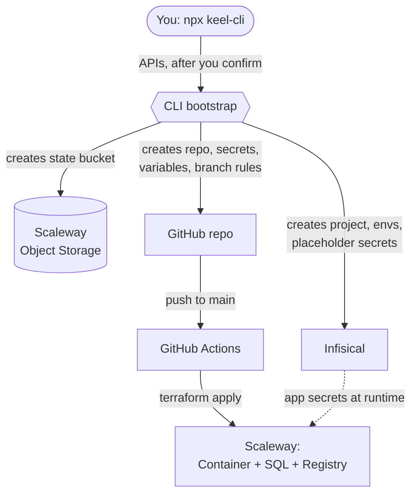

# keel

### The keel your product is built on - one command, from nothing to a running serverless backend.

A ship's keel is the first beam laid down, the backbone everything else is
built onto. `keel` lays that foundation for your product: start on the
**near-free tier**, scale when you do. No Terraform, no cloud CLI, no YAML to
write. Just Node.

  


Node
Terraform
Scaleway
GitHub Actions
License

  


```sh
npx keel-cli
```


---


## What this is for

Getting a real backend online usually means gluing together a cloud account, a
container runtime, a database, a state store, a CI/CD pipeline and a secret
manager, then wiring credentials through all of them without leaking anything.
It is a day of undifferentiated setup before you write a single line of product.

**keel collapses that into one command.** You answer a few
questions and get a Git repository that, on its first push, provisions a
complete serverless backend on [Scaleway](https://www.scaleway.com):

- **Near-free to start.** Compute and database both scale to zero. With no
traffic, you pay cents (just the state bucket). No 12-month trial that
expires, no idle instances quietly billing you.
- **Scales with your product.** The same repo grows from a weekend project
to production: bump the scaling numbers in a tfvars file, open a PR, merge.
Terraform and two isolated environments (staging + prod) are there from day
one.
- **Secure by construction.** No secret ever touches the repository.
Credentials live in encrypted CI storage and in a dedicated secret manager.
- **Infrastructure only, zero lock-in of your code.** Your app is just a
Docker image. No framework, no proprietary function format, nothing to
rewrite if you ever move.

The tool does the **bootstrap** (creates the accounts' resources and the repo);
the **first** `terraform apply` **runs in CI**, not on your laptop, so nobody needs
local tooling or production credentials on their machine.

---


## How it works




**Phase A** happens on your machine, in seconds. **Phase B** happens in CI, on
the first merge to `main`.

---


## The stack, and why these choices


| Layer        | Service                            | Why this one                                                         |
| ------------ | ---------------------------------- | -------------------------------------------------------------------- |
| **Compute**  | Scaleway Serverless Containers     | Runs any Docker image, scales to zero, no cluster or VPC to manage   |
| **Database** | Scaleway Serverless SQL (Postgres) | Real Postgres that also scales to zero, no instance sizing           |
| **State**    | Scaleway Object Storage            | S3-compatible, same provider, versioned, no extra account            |
| **IaC**      | Terraform                          | Declarative, reviewable in PRs, nothing click-configured             |
| **CI/CD**    | GitHub Actions                     | `plan` on PRs, `apply` on merge; Terraform runs in CI, never locally |
| **Secrets**  | Infisical                          | App secrets in one place, per-environment, rotate without a commit   |


### Why Scaleway, and not AWS or the others

AWS can absolutely do this, but "serverless backend" on AWS means assembling
Lambda **+** API Gateway **+** Aurora/RDS **+** ECR **+** S3 **+** a thick layer
of IAM, each with its own knobs. It is powerful and it is a lot. This tool
optimizes for a different thing: **the shortest path from nothing to a running,
cheap, scalable backend.**

- **Truly scale-to-zero, on both tiers.** Scaleway Serverless Containers *and*
Serverless SQL bill on actual usage and drop to zero when idle. On AWS,
compute scales to zero but a serverless database typically keeps a minimum
billable capacity running. For a project that is quiet most of the time, that
difference is the whole point.
- **Cost that starts near zero and stays predictable.** No free tier clock that
expires after 12 months; you pay for what you serve, per second.
- **Far less to assemble and secure.** A handful of resources instead of a
sprawl of services and IAM policies. Less surface to misconfigure.
- **Standard containers, not a proprietary packaging model.** Your app is a
plain Docker image on a port. Portable by default: nothing here traps your
code on one vendor.
- **EU-based, straightforward pricing and data residency**, which many teams
actually need.

The trade-off is honest: Scaleway has a smaller catalog than the hyperscalers.
If you need a specific managed AWS service, this is not for you. If you want a
serverless product online today for near nothing, it is a great fit.

### Why Infisical for secrets

Secrets are the easiest thing to get wrong. The failure mode is a `DATABASE_URL`
committed "just for now", or credentials copy-pasted across the Scaleway
console, GitHub settings and a local `.env` until nobody knows the source of
truth.

- **One source of truth for application secrets**, separate from the code and
from CI credentials, with clean `staging` / `prod` separation.
- **Rotate without a deploy.** Change a value in Infisical and the next apply
picks it up. No commit, no pipeline edit.
- **Read from both sides.** Terraform reads secrets at plan/apply, the running
container reads them at runtime, from the same place.
- **Open source and self-hostable.** Point the tool at your own instance and you
are not locked to a SaaS.

CI credentials (the Scaleway and Infisical keys themselves) stay in GitHub
Actions encrypted secrets, because that is what CI needs to boot. Everything
your *application* consumes lives in Infisical.

---


## Prerequisites

You need three accounts and their credentials. Nothing else is installed
locally: the CLI talks to each service through its API.

**Local machine**: Node.js >= 18 and `git`.

**Scaleway** (the cloud provider)

1. Create an account and a project at [console.scaleway.com](https://console.scaleway.com).
2. Generate an API key (IAM > API keys > Generate): you need the **access key**
  and the **secret key**.
3. Note your **project ID** and **organization ID** (Project Dashboard).
4. The key needs to create Object Storage buckets and manage Serverless
  Containers, Serverless SQL and the Registry (`ObjectStorageFullAccess`,
   `ContainersFullAccess`, `ServerlessSQLDatabaseFullAccess`,
   `ContainerRegistryFullAccess`, plus `IAMManager` so Terraform can create
   the app's dedicated least-privilege database credential, or broader).


**Infisical** (the secret manager)

1. Create an account at [app.infisical.com](https://app.infisical.com) (or use a
  self-hosted instance).
2. Create a **Machine Identity** with **Universal Auth**: you need its
  **client ID** and **client secret**.
3. Give the identity permission to create and manage projects.


**GitHub** (code hosting and CI)

1. Create a token at [github.com/settings/tokens](https://github.com/settings/tokens)
  with the `repo` and `workflow` scopes (classic), or a fine-grained token
   allowed to create repos and manage Actions secrets, variables, environments
   and branch protection.


The CLI **validates every credential before creating anything**: wrong keys
fail fast, with nothing half-created.

---


## Usage

Interactive (recommended the first time). It asks for the project name,
region, repository name and **visibility (public or private)**, and picks up
`SCW_*` / `INFISICAL_*` / `GITHUB_TOKEN` from your environment as defaults:

```sh
npx keel-cli
```

Before touching a single account, it shows a **full summary of what it will
create and where**, and waits for your confirmation.

Non-interactive, for scripts:

```sh
export SCW_ACCESS_KEY=... SCW_SECRET_KEY=...
export SCW_DEFAULT_PROJECT_ID=... SCW_DEFAULT_ORGANIZATION_ID=...
export INFISICAL_CLIENT_ID=... INFISICAL_CLIENT_SECRET=...
export GITHUB_TOKEN=...

npx keel-cli --yes --name my-app --region fr-par --private
```

Preview everything without touching any account:

```sh
npx keel-cli --dry-run --yes --name my-app
```

---


## What gets created, and when

**Phase A, bootstrap (the CLI, via APIs, after your confirmation)**


| Where        | What                                                                                                                                                                                                                                                                                     |
| ------------ | ---------------------------------------------------------------------------------------------------------------------------------------------------------------------------------------------------------------------------------------------------------------------------------------- |
| Your machine | The generated repo: Terraform, workflows, README, initial git commit                                                                                                                                                                                                                     |
| Scaleway     | One Object Storage bucket for Terraform state (`<name>-tfstate`, versioned)                                                                                                                                                                                                              |
| GitHub       | Repository (public or private, your choice) pushed to `main`; encrypted Actions **secrets** (Scaleway + Infisical); Actions **variables** (bucket, region, Infisical project); `staging` and `production` environments, the latter gated by manual approval; branch protection on `main` |
| Infisical    | A project with `staging` and `prod`, seeded with `BASIC_AUTH_USER` / `BASIC_AUTH_PASSWORD` (staging, random password) and a `DATABASE_URL` placeholder per environment                                                                                                                   |


**Phase B, first deploy (Terraform in GitHub Actions, on push to** `main`**)**


| Scaleway resource                          | Notes                                                                                                            |
| ------------------------------------------ | ---------------------------------------------------------------------------------------------------------------- |
| Registry namespace                         | Private, one per environment                                                                                     |
| Container namespace + Serverless Container | The container appears once you set `container_image` in the tfvars; registry and database are created right away |
| Serverless SQL Database                    | One per environment; after each apply the pipeline writes a ready-to-use connection string to Infisical as `DATABASE_URL` |
| IAM application + API key                  | Dedicated credential that can only read/write the database (least privilege), embedded in `DATABASE_URL`         |


No custom domain is configured: the app gets an auto-generated Scaleway URL.
Add one later with a single `scaleway_container_domain` resource.

---


## The generated repository

```
my-app/
├── README.md                    # operating manual for the repo
├── .github/workflows/
│   ├── terraform-plan.yml       # PR: fmt + validate + plan (staging & prod)
│   ├── terraform-apply.yml      # main: apply staging -> approval -> apply prod
│   └── terraform-drift.yml      # weekly: read-only plan, opens an issue on drift
├── versions.tf · providers.tf · backend.tf
├── backend.hcl.example          # state bucket coordinates (backend.hcl is git-ignored)
├── variables.tf · main.tf · outputs.tf
├── staging.tfvars · prod.tfvars # non-sensitive config only, committed
└── modules/app_stack/           # registry + container + database
```

Environments are separated with **Terraform workspaces**: same code, two
independent states in one bucket, differences confined to the two `.tfvars`
files.

### Where every piece of data lives


| Data                              | Lives in                 | Why                                                    |
| --------------------------------- | ------------------------ | ------------------------------------------------------ |
| Scaleway API keys                 | GitHub encrypted secrets | CI needs them to run Terraform                         |
| Infisical machine identity        | GitHub encrypted secrets | Lets Terraform read app secrets at plan/apply          |
| Basic Auth user/password          | Infisical (staging)      | App secret, injected into the container, rotatable     |
| Database connection string        | Infisical (both envs)    | Doesn't exist until the DB does; complete, ready-to-use value synced after each apply |
| Bucket, region, Infisical project | GitHub variables         | Non-sensitive wiring, editable in one place            |
| Project name, scaling, image      | Committed tfvars         | Reviewable configuration, no secrets                   |


---


## After the bootstrap

1. **Push to** `main` (or merge a PR): the pipeline provisions registry and
  databases. Approve the `production` gate when prompted.
2. **Build and push your app image** to the registry endpoint from the apply
  output:
3. **Set** `container_image` in the tfvars and open a PR: the next apply creates
  the containers.
4. **Replace the placeholder secrets** in Infisical with real values. The app
  reads `DATABASE_URL` and `BASIC_AUTH_*` from its environment; on staging it
   also receives `BASIC_AUTH_ENABLED=true` and enforces it.

---


## Security model

- **No secret ever lands in the repository**: not in Terraform, not in tfvars,
not in workflows. `backend.hcl` and local state are git-ignored.
- The CLI never logs credentials and redacts them in the summary. The GitHub
token is handed to `git push` through an ephemeral askpass helper, so it never
appears in remote URLs, `.git/config` or the process list.
- Actions secrets are encrypted client-side (libsodium sealed box) before
upload.
- `main` is protected: force pushes and deletion blocked, PRs need a green plan,
production applies need manual approval.
- Terraform state lives in a private, versioned bucket, with S3-native state
locking (`use_lockfile`) so concurrent applies cannot corrupt it.
- The app connects to its database with a **dedicated least-privilege IAM
credential** (read/write on the database, nothing else), not with your main
API key.
- A weekly drift-detection plan opens an issue when the real infrastructure
no longer matches the code.

---


## What it costs to start

`keel` is tuned to sit **near the free tier** while you have little or no
traffic. Compute scales to zero on both the container and the database, so an
idle project (staging **and** prod) costs cents, not euros. A rough monthly
picture for a minimal setup (Scaleway `fr-par` list prices, excl. VAT):


| Component                           | Minimal setup                     | Monthly cost                                   |
| ----------------------------------- | --------------------------------- | ---------------------------------------------- |
| Serverless Containers (both envs)   | scale-to-zero, low traffic        | **~€0** (200k vCPU-s + 400k GB-s free / month) |
| Serverless SQL (both envs)          | idle most of the time, ~1 GB each | **~€0.20** storage + a few cents of compute    |
| Object Storage (Terraform state)    | a few MB                          | **~€0**                                        |
| Container Registry (private images) | 1-2 image versions                | **~€0.05** (or €0 if the registry is public)   |
| **Total to start**                  |                                   | **under ~€1 / month**                          |


The key is that compute is billed per second, and only while it is actually
serving: an idle container and a paused database drop to zero and you pay just
a few cents of storage. Cost grows with **real usage**, not with the number of
environments. Standing free allowances include 200,000 vCPU-seconds and
400,000 GB-seconds of container time per month, 75 GB of egress, and public
registry storage up to 75 GB.

When traffic arrives, the same setup scales up smoothly: raise `min_scale` /
`max_scale` in the tfvars and you move from "near free" to paying for the
capacity you actually use, with no re-architecting.

---


## Failure recovery

Every bootstrap step checks whether its resource already exists, and progress
is recorded in `.keel.json` inside the project directory. If a
run fails halfway, fix the cause and **re-run the same command**: completed
steps are skipped, existing resources are reused, nothing is duplicated.

---


## FAQ

**Do I need Terraform,** `scw` **or** `gh` **installed?**
No. The CLI bootstraps via APIs; Terraform runs inside GitHub Actions.

**Can the repository be private?**
Yes. The CLI asks for the name and the visibility; default is public (the infra
holds no secrets), or choose private interactively or with `--private`.

**Why is the container not created on the first apply?**
A Serverless Container needs an image, and none exists yet. Registry and
database are created immediately; the container is gated on `container_image`,
so the first apply is green instead of failing.

**Why Basic Auth "at the app level"?**
Scaleway Serverless Containers have no built-in auth in front of public
endpoints. Credentials live in Infisical, the container gets
`BASIC_AUTH_ENABLED=true`, and a few lines of middleware enforce it.

**Can I add more environments?**
Yes: add a workspace, a `<env>.tfvars`, an Infisical environment, and mirror one
job in each workflow.

---


## CLI reference

```
--name <name>                  Project name (dns-safe: lowercase, digits, hyphens)
--dir <path>                   Target directory (default: ./<name>)
--region <region>              fr-par | nl-ams | pl-waw (default: fr-par)
--scw-access-key <key>         or env SCW_ACCESS_KEY
--scw-secret-key <key>         or env SCW_SECRET_KEY
--scw-project-id <id>          or env SCW_DEFAULT_PROJECT_ID
--scw-organization-id <id>     or env SCW_DEFAULT_ORGANIZATION_ID
--infisical-host <url>         or env INFISICAL_HOST (default: https://app.infisical.com)
--infisical-client-id <id>     or env INFISICAL_CLIENT_ID
--infisical-client-secret <s>  or env INFISICAL_CLIENT_SECRET
--infisical-project-name <n>   Infisical project (default: project name)
--github-token <token>         or env GITHUB_TOKEN (scopes: repo, workflow)
--repo-name <name>             GitHub repository name (default: project name)
--private                      Create the repository as private (default: public)
--no-basic-auth                Disable Basic Auth on staging
--staging-min-scale <n>        Default 0        --staging-max-scale <n>   Default 1
--prod-min-scale <n>           Default 0        --prod-max-scale <n>      Default 2
--config <file.json>           Load answers from a JSON file
--advanced                     Also ask scaling questions interactively
--yes                          Accept defaults, skip the confirmation prompt
--dry-run                      Generate locally, touch no account
```

---


## Development

```sh
npm install
npm run build              # tsc -> dist/
npm test                   # vitest unit tests
npm run lint               # eslint
npm run verify:templates   # render templates + terraform fmt/validate (needs terraform)
node dist/index.js --dry-run --yes --name demo   # end-to-end without accounts
```

---


**MIT licensed.** Built for shipping serverless products without the setup tax.

